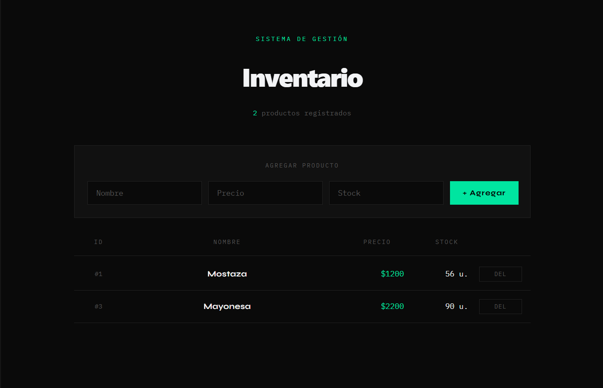

# Inventario Frontend

Dashboard web para gestión de inventario, construido con React y Vite. Consume la [Inventario API](https://github.com/iburgosDev/inventario-api) desarrollada con FastAPI.

## Vista previa



## Tecnologías

- React 18
- Vite
- CSS personalizado (sin librerías de UI)

## Requisitos

- Node.js 18+
- [Inventario API](https://github.com/iburgosDev/inventario-api) corriendo en `http://localhost:8000`

## Instalación
```bash
npm install
npm run dev
```

Abre http://localhost:5173 en el navegador.

## Funcionalidades

- Listar productos del inventario
- Agregar producto nuevo
- Eliminar producto